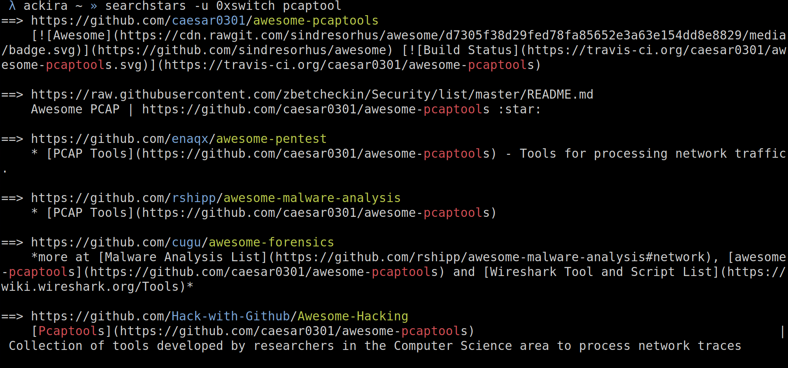

# starscrawler

search keywords through github users stars README.md

## Usage

starscrawler.py -u 0xswitch keywordA keywordB

You can also use the `--and` parameter in order to match both keyword, by default and boolean OR is done.

* `-u` to specify the user to fetch stars from

* `-c` to specify the amount of stars you want to crawls (`ceil(amout / 100)`)

* `--flush` to force download README.md again
